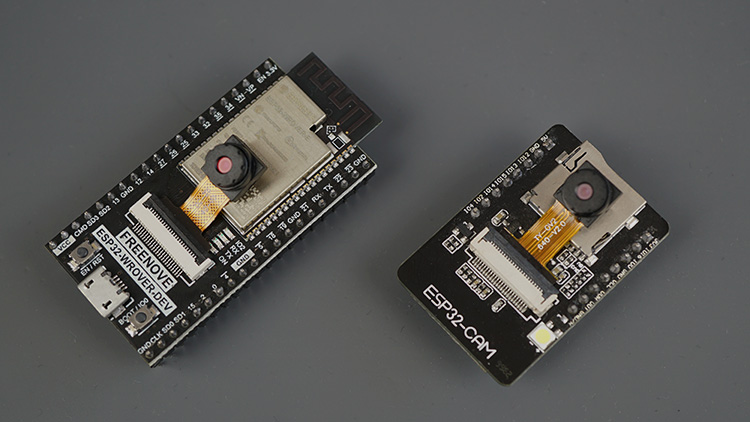

## About

This is a pet project for learning the Rust language and using it on an ESP32 microcontroller device with camera module.
The aim is to have the device take images of a garage door on-demand so I can remotely check if I forgot to close it.

A central controller (todo) running on a separate single-board computer will be responsible for receiving requests
from mobile devices and dispatching relevant commands to the microcontroller.

The aim is to communicate with the microcontroller directly via TCP. HTTP packet structure is unnecessary overhead.

- Mobile App <-HTTP-> Central Controller (SBC) <-TCP-> ESP32+Camera

## Hardware



This projects currently supports two variants of ESP32 board:

- Freenove WROVER
- AIThinker WROOM

And two camera modules:

- OV2640
- OV5640

## Starting a blank project with `esp32-camera` bindings

Your aim and approach for using an ESP32 and a camera module are probably different to mine.
The following commands are a quick start for setting up a blank project with the camera module Rust bindings ready to go.
Hopefully it helps someone hit the ground running.

First setup `espup` and the toolchain, and be sure to set env vars before compiling:
`. ~/export-esp.sh`

```sh
# use cargo and the ESP IDF template to create a project
git https://github.com/esp-rs/esp-idf-template cargo
cd <project_dir>
# clone the camera module C library (can be as a git submodule)
git clone git@github.com:espressif/esp32-camera.git
# create a header file for bindgen to use
touch esp32-camera-bindings.h
echo '#include "esp32-camera/driver/include/esp_camera.h"' > esp32-camera-bindings.h
# enable PSRAM on the ESP32 (needed for camera)
echo 'CONFIG_ESP32_SPIRAM_SUPPORT=y' >> sdkconfig.defaults
```

Edit `Cargo.toml` and configure an extra component (`esp-idf-sys` handles bindgen):

```toml
[package.metadata.esp-idf-sys]
extra_components = [
  { component_dirs = "./esp32-camera", bindings_header = "esp32-camera-bindings.h", bindings_module = "esp_camera" }
]
```
